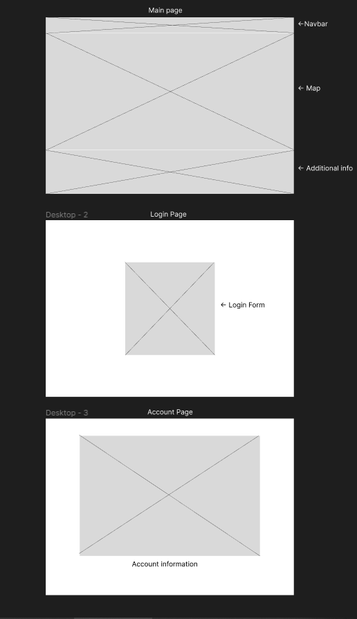
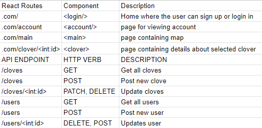
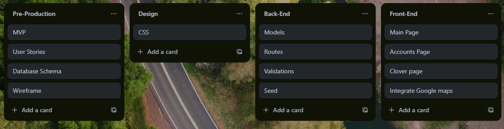

# Disclovery

Disclovery is an app designed for users to mark and view the location of four leaf clovers.

# user stories

- As a user, I want to be able to make an account and record the location of 4 leaf clovers for other users to see. Each entry will be represented by an icon of the clover on the map

- As a user, I want to view the locations of four leaf clovers on a map interface

- As a user, I want to be able to attach photos of the clover for each entry that can be viewed by clicking into the icon.

- As a user, I want to be able to view the account of other people and see what clovers they've found

- As a user, I want to be able to indicate to the user of the clover I found the clover that they originally discovered. The amount of times a single clover has been "rediscovered" will be indicated as a counter near its icon on the map.

# stretches

- Use google authenticator to securely sign up and log in
- Leaderboard of most frequently rediscovered clovers

# New Technologies

- Redux

# DB Schema

# Wireframe

# API Routes

# Trello

